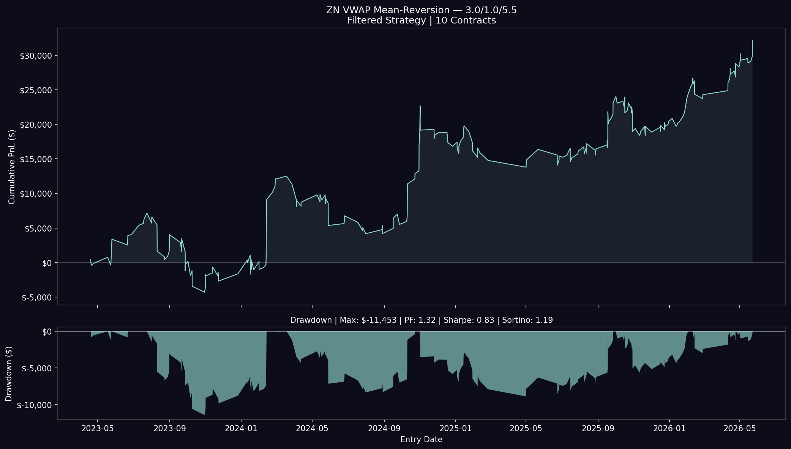
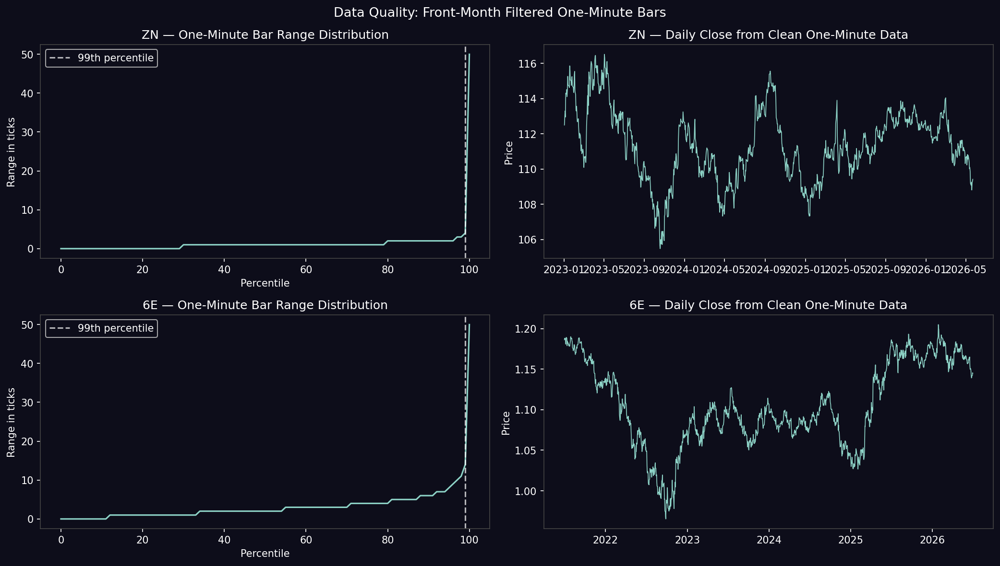

{
 "cells": [
  {
   "cell_type": "markdown",
   "id": "5f08b8a7-d07b-4cb4-9166-5d84c1367830",
   "metadata": {},
   "source": [
    "# VWAP Mean Reversion in Futures Markets\n",
    "### Statistical Validation, Data Engineering, and Systematic Strategy Research\n",
    "#### ZN 10-Year Treasury Note Futures &nbsp;·&nbsp; 6E Euro FX Futures\n"
   ]
  },
  {
   "cell_type": "markdown",
   "id": "1b227a42-88d9-4b34-b228-de66c57d3d90",
   "metadata": {},
   "source": [
    "> **Bottom line**: ZN Treasury futures exhibit a statistically significant intraday mean-reversion signal around the daily VWAP — measurable, filterable, and profitable after realistic transaction costs. The same framework applied to Euro FX produces a consistent negative result. The project treats statistical significance and economic profitability as related but distinct questions, and presents both outcomes honestly.\n"
   ]
  },
  {
   "cell_type": "markdown",
   "id": "1d275b27-0b46-46ed-aedb-b76bf39badb3",
   "metadata": {},
   "source": [
    "**Reproducibility:** The complete analysis is contained in a single Jupyter notebook — from raw Databento tick data → statistical validation → backtesting → Monte Carlo analysis → live deployment."
   ]
  },
  {
   "cell_type": "markdown",
   "id": "4242ebf4-2ddf-4225-b5a6-1f9105583938",
   "metadata": {},
   "source": [
    "## Highlights\n",
    "\n",
    "### ZN Treasury Futures\n",
    "- **Identified and corrected** systematic contamination in commercial futures tick data — cross-validated against independently sourced Rithmic historical bars\n",
    "- **Intraday AR(1) half-life ≈ 19 minutes** (R² = 0.932), confirming statistically significant mean reversion\n",
    "- **Live z-score exits outperform fixed-price targets** — the project decomposes z-score reversion into price movement and VWAP drift, and demonstrates that exits must track both\n",
    "- **Regime filters doubled trade expectancy** while reducing frequency by ~72%\n",
    "\n",
    "| Configuration | Trades | Expectancy | Total PnL | Max DD | Sharpe | Sortino |\n",
    "|---------------|--------|-----------|-----------|--------|--------|---------|\n",
    "| 2.0 / 1.0 / 4.0 | 864 | \\$37 | \\$31,607 | −\\$13,679 | 0.74 | 0.78 |\n",
    "| **2.5 / 1.0 / 5.0** | **484** | **\\$76** | **\\$36,875** | **−\\$11,082** | **0.97** | **1.32** |\n",
    "| 3.0 / 1.0 / 5.5 | 264 | \\$122 | \\$32,145 | −\\$11,453 | 0.83 | 1.19 |\n",
    "\n",
    "*10 contracts, full historical period. Entry σ / Exit σ / Stop σ.*\n",
    "\n",
    "- **Best prop-firm configuration**: ~56% Monte Carlo evaluation pass rate under Apex 150K trailing drawdown rules\n",
    "- **Live deployment** via Rithmic API — confirmed real fills, bracket order management, and fault-tolerant reconnect logic\n"
   ]
  },
  {
   "cell_type": "markdown",
   "id": "93658395-9ea7-44c9-a01d-2092be852e9b",
   "metadata": {},
   "source": [
    "### 6E Euro FX\n",
    "- Mean reversion is **statistically present** (half-life ≈ 38 min, reversion rate 79%)\n",
    "- Strategy is **consistently unprofitable after realistic commissions** across all tested configurations\n",
    "- Demonstrates the distinction between *statistical significance* and *economic profitability*: the lower tick value ($6.25 vs $15.625) and identical commission structure make the same signal unviable in 6E\n"
   ]
  },
  {
   "cell_type": "markdown",
   "id": "0678b07e-7991-405c-9347-1e0e247eae19",
   "metadata": {},
   "source": [
    "## Equity Curves\n",
    "\n",
    "*Three filtered ZN configurations over the full historical period (10 contracts each). The 2.5/1.0/5.0 configuration produces the strongest standalone risk-adjusted profile.*\n",
    "The figures below summarize the progression from cleaned data to validated trading results.\n",
    "\n",
    "\n"
   ]
  },
  {
   "cell_type": "markdown",
   "id": "3421b7ec-166f-4037-8e98-b3aeeffcfe43",
   "metadata": {},
   "source": [
    "## Data Quality\n",
    "\n",
    "*Before and after front-month contract filtering. Parent symbology mixing introduces calendar spread prices (ZNH3-ZNM3 ≈ −0.63) as bar lows in outright OHLCV data. After correction, bar ranges align with independently sourced Rithmic historical bars.*\n",
    "\n",
    "\n"
   ]
  },
  {
   "cell_type": "markdown",
   "id": "aa661941-626b-44f2-81f0-9f6a4bc66843",
   "metadata": {},
   "source": [
    "## Monte Carlo Results\n",
    "\n",
    "*10,000 Student's-t simulations under Apex 150K EOD trailing drawdown rules. Regime filtering materially improves pass rates and expected net across all tested configurations.*\n",
    "\n",
    "\n"
   ]
  },
  {
   "cell_type": "markdown",
   "id": "ef5f3337-93e6-4ec5-a7f0-ae0b5fd91452",
   "metadata": {},
   "source": [
    "## Repository Contents\n",
    "\n",
    "| File | Description |\n",
    "|------|-------------|\n",
    "| `vwap_mean_reversion_futures.ipynb` | Complete research notebook (15 sections) |\n",
    "| `README.md` | This file |\n",
    "| `zn_1min_clean.parquet` | Generated clean ZN 1-min dataset |\n",
    "| `6e_1min_clean.parquet` | Generated clean 6E 1-min dataset |\n",
    "| `6e_bot.py` | Live trading bot (credentials removed) |\n",
    "| `images/` | Charts and figures referenced in this README |\n",
    "\n",
    "*Raw Databento DBN files are not included — they require a commercial data subscription. The aggregation cells in the notebook reconstruct the clean parquets from raw files.*\n",
    "\n"
   ]
  },
  {
   "cell_type": "markdown",
   "id": "01d5e871-5cf0-4d68-979b-28d1e84bca14",
   "metadata": {},
   "source": [
    "## Research Workflow\n",
    "\n",
    "| Section | Content |\n",
    "|---------|---------|\n",
    "| 1 | Imports & constants |\n",
    "| 2 | Data acquisition & quality validation |\n",
    "| 3 | VWAP signal construction |\n",
    "| 4 | AR(1) / Ornstein-Uhlenbeck diagnostics |\n",
    "| 5 | Mean-reversion & VWAP drift decomposition |\n",
    "| 6 | Walk-forward IS/OOS design |\n",
    "| 7 | Backtest engine |\n",
    "| 8 | Parameter & regime-filter comparison |\n",
    "| 9 | Monte Carlo stress testing |\n",
    "| 10 | Empirical Kelly position sizing |\n",
    "| 11 | Contract-size optimization & historical replay |\n",
    "| 12 | 6E cross-market validation |\n",
    "| 13 | Standalone strategy comparison |\n",
    "| 14 | Calendar spread extension (theoretical) |\n",
    "| 15 | Conclusions |\n",
    "\n"
   ]
  },
  {
   "cell_type": "markdown",
   "id": "bebb981b-dc2e-431d-8e05-0af0af179f42",
   "metadata": {},
   "source": [
    "## Data Engineering\n",
    "\n",
    "One of the most significant findings during the project was **systematic contamination in commercial futures tick data**.\n",
    "\n",
    "Using Databento parent symbology (`stype_in=\"parent\"`), calendar spreads and back-month contracts are silently mixed with outright futures trades during aggregation. These prices are economically valid for spread instruments but produce impossible OHLC values when combined with outright bars:\n",
    "\n"
   ]
  },
  {
   "cell_type": "markdown",
   "id": "ac367017-1efc-4aee-8f00-0e7de2295cc5",
   "metadata": {},
   "source": [
    "ZN outright price  ≈  115.00\n",
    "ZNH3-ZNM3 spread  ≈   −0.63   ← becomes bar low after aggregation\n"
   ]
  },
  {
   "cell_type": "markdown",
   "id": "276109c3-88d9-4f3f-86e4-72a89ab51652",
   "metadata": {},
   "source": [
    "\n",
    "A single spread trade inside a one-minute window incorrectly became the bar low, inflating apparent intrabar ranges by orders of magnitude. Cross-validation against independently sourced Rithmic server-side bars confirmed the issue — Rithmic showed a median 1-minute bar range of 2 ticks; raw parent-symbology data showed a mean range of ~10 ticks.\n",
    "\n",
    "**Solution**: reconstruct the dataset by filtering every daily DBN file to the active front-month contract using a quarterly roll calendar. After correction:\n",
    "- Zero impossible prices\n",
    "- Median bar ranges consistent with Rithmic ground truth\n",
    "- Backtest performance materially more realistic than pre-correction results\n"
   ]
  },
  {
   "cell_type": "markdown",
   "id": "a96fa669-62f0-436e-b75f-8adfa4798887",
   "metadata": {},
   "source": [
    "## Statistical Findings\n",
    "\n",
    "### Mean Reversion Signal\n",
    "\n",
    "VWAP deviations exhibit statistically significant mean reversion in both instruments:\n",
    "\n",
    "| Metric | ZN | 6E |\n",
    "|--------|----|----|\n",
    "| Intraday AR(1) half-life | **19.2 min** | 38.0 min |\n",
    "| Intraday AR(1) R² | **0.932** | 0.963 |\n",
    "| 2.5σ → 1.0σ reversion rate (4hr) | **80.7%** | 79.0% |\n",
    "| Median time to reversion | **46 min** | 45 min |\n",
    "\n",
    "### VWAP Drift Decomposition\n",
    "\n",
    "Rather than assuming price alone returns to VWAP, the project decomposes observed z-score reversion into two independent components:\n",
    "\n",
    "1. **Price movement toward VWAP**\n",
    "2. **VWAP movement toward price** — as new trades enter the cumulative volume-weighted average\n",
    "\n",
    "For ZN reversions: price accounts for ~**54%**, VWAP drift ~**46%**.  \n",
    "For 6E reversions: price accounts for ~**49%**, VWAP drift ~**51%**.\n",
    "\n",
    "This decomposition is critical for exit design. A fixed-price target set at entry ignores VWAP drift entirely. A **live z-score exit** — closing when the current z-score reaches the target level using the current VWAP and std — captures both components and materially outperforms fixed-price alternatives.\n"
   ]
  },
  {
   "cell_type": "markdown",
   "id": "ff2f64ac-19b4-4d48-b5af-a8f61632f8dc",
   "metadata": {},
   "source": [
    "\n",
    "## Strategy Design\n",
    "\n",
    "### Signal\n",
    "- **Entry**: |z-score| crosses entry threshold between consecutive bars, with |z-score| < stop threshold (ensures valid stop geometry)\n",
    "- **Exit**: live z-score returns to exit threshold using current VWAP/std\n",
    "- **Stop**: fixed price level set at entry-time VWAP ± stop-threshold × std\n",
    "\n",
    "### Regime Filters\n",
    "| Filter | Threshold | Rationale |\n",
    "|--------|-----------|-----------|\n",
    "| ATR percentile | < 85th pct (60-day window) | Suppress entries on unusually volatile days |\n",
    "| Prior-session yield move | < 3 bps | Rate shock days break mean reversion |\n",
    "| Volume ratio | < 3× 20-bar trailing average | Avoid news-spike bars |\n",
    "| Warm-up bars | ≥ 60 bars (1 hour) | Require sufficient history for stable VWAP/std |\n",
    "\n",
    "Filters are applied using **only information available at session open** — no look-ahead bias.\n",
    "\n"
   ]
  },
  {
   "cell_type": "markdown",
   "id": "f552f47b-bf9e-4931-bef5-67c534f9f9c9",
   "metadata": {},
   "source": [
    "## Validation\n",
    "\n",
    "The project intentionally retains intermediate analyses—including unsuccessful parameterizations and a negative cross-market result—to emphasize reproducibility and reduce selection bias.\n",
    "Multiple independent techniques were used to evaluate robustness:\n",
    "\n",
    "- **Walk-forward IS/OOS testing** — 13 interleaved holdout months across the full date range\n",
    "- **Parameter sweep** — four entry/exit/stop configurations with and without regime filters\n",
    "- **Monte Carlo simulation** — 10,000 paths using Student's-t distribution (fat-tail aware)\n",
    "- **Historical path replay** — actual trade sequence replayed against modeled prop-firm rules\n",
    "- **Standalone account comparison** — Sharpe, Sortino, profit factor across configurations\n",
    "- **Cross-market validation** — same methodology applied to 6E as a robustness test\n",
    "- **Live deployment** — real fills via Rithmic API confirming executable strategy behavior\n",
    "\n"
   ]
  },
  {
   "cell_type": "markdown",
   "id": "fc187ebb-ae01-4d20-842f-88193fee76f9",
   "metadata": {},
   "source": [
    "## Live Deployment\n",
    "\n",
    "The strategy was implemented as a fully automated trading system using the Rithmic API (`async_rithmic`). The system included:\n",
    "\n",
    "- **Asynchronous order execution** with bracket management (stop + target)\n",
    "- **Real-time VWAP computation** — daily reset at midnight UTC, expanding std\n",
    "- **Session-aware regime filtering** — ATR check and yield filter at session open\n",
    "- **Telegram trade notifications** — entry, exit, and session summary alerts\n",
    "- **Fault-tolerant reconnect logic** — exponential backoff with state preservation\n",
    "- **Fill notification handling** — distinguishing entry fills from bracket exits\n",
    "\n",
    "Live deployment validated that the production implementation behaved consistently with the research implementation while exposing several execution-specific issues that were subsequently corrected.\n",
    "\n"
   ]
  },
  {
   "cell_type": "markdown",
   "id": "b8b58177-ceaa-4a7b-bd7d-8ba0c2511a5f",
   "metadata": {},
   "source": [
    "## Calendar Spread Extension\n",
    "\n",
    "Although electronic calendar spreads in Treasury and FX futures proved too illiquid for practical backtesting (~18 trades/day for ZNH3-ZNM3), the methodology appears well suited for **commodity calendar spreads**.\n",
    "\n",
    "Markets such as crude oil (CL) and natural gas (NG) exhibit 5,000–15,000 electronic spread trades per day. Calendar spreads also offer a more interpretable mean-reversion anchor than intraday VWAP alone: the spread converges to the cost-of-carry differential, providing an economic equilibrium grounded in storage costs, financing rates, and convenience yield — directly relevant to physical commodity trading.\n",
    "\n"
   ]
  },
  {
   "cell_type": "markdown",
   "id": "9852c71e-e06c-433f-be38-f2b5bd250139",
   "metadata": {},
   "source": [
    "\n",
    "## Technologies\n",
    "`Databento` &nbsp;·&nbsp; `FRED API` &nbsp;·&nbsp; `Matplotlib` &nbsp;·&nbsp; `NumPy` &nbsp;·&nbsp; `Pandas` &nbsp;·&nbsp; `Python` &nbsp;·&nbsp; `Rithmic API (async_rithmic)` &nbsp;·&nbsp; `SciPy` &nbsp;·&nbsp; `Statsmodels`\n"
   ]
  },
  {
   "cell_type": "markdown",
   "id": "08b5e51a-14a2-4a78-a6b0-6dd767d3d0d3",
   "metadata": {},
   "source": [
    "## Author\n",
    "\n",
    "**Ein Clark**  \n",
    "Independent Quantitative Research · 2024–2026  \n",
    "B.S. Economics — Minors: Mathematics, Physics, Finance  \n",
    "West Virginia University · 2023\n"
   ]
  },
  {
   "cell_type": "code",
   "execution_count": null,
   "id": "13e10c52-94ac-40ad-afd8-eb526447ae57",
   "metadata": {},
   "outputs": [],
   "source": []
  }
 ],
 "metadata": {
  "kernelspec": {
   "display_name": "Python 3 (ipykernel)",
   "language": "python",
   "name": "python3"
  },
  "language_info": {
   "codemirror_mode": {
    "name": "ipython",
    "version": 3
   },
   "file_extension": ".py",
   "mimetype": "text/x-python",
   "name": "python",
   "nbconvert_exporter": "python",
   "pygments_lexer": "ipython3",
   "version": "3.13.9"
  }
 },
 "nbformat": 4,
 "nbformat_minor": 5
}
